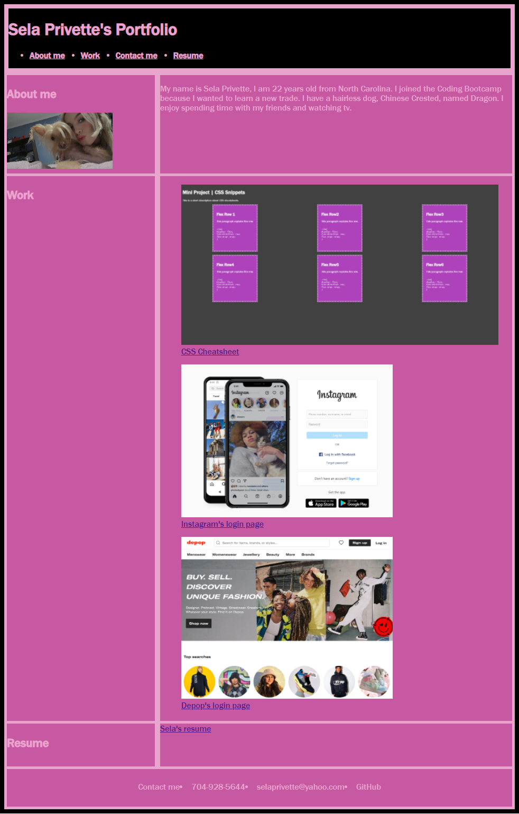

# Horiseon SEO Refactor

## Table of Contents
1. [Description](#description)
2. [Visuals](#visuals)
3. [Resources](#resources)

## Description
Made a viewable, user-friendly, portfolio page that can be revisited when need be. Portfolio includes previous work, a resume, example photos, and a little bit about me. When you view the page you can see tabs that will take user to the correct sections. The pictures are also clickable  , so that users can go to external pages. 

## Visuals

## Resources
- [Live Site](https://selaprivette.github.io/portfolio/) 
- [Repository](https://github.com/selaprivette/portfolio)